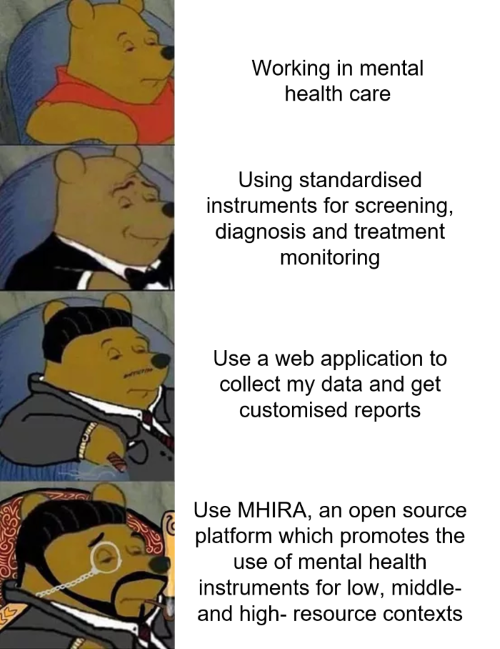
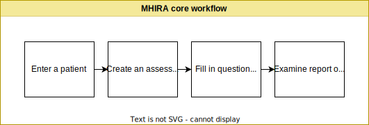

# Introduction

A large proportion of the [world's disease burden](https://www.thelancet.com/journals/lanpsy/article/PIIS2215-0366(21)00395-3/fulltext#:~:text=GBD%202019%20confirmed%20that%20a,a%20reduction%20in%20the%20burden) is attributable to mental disorders. In fact mental disorders are among the leading causes.  An important aspect of the mental health treatment gap is the [diagnostic gap](https://www.thelancet.com/journals/lancet/article/PIIS0140-6736(21)00673-5/fulltext) (i.e., the proportion of the population with a condition who remain undiagnosed). 
Done right, digital solutions offer the potential to enhance coverage and quality of health services. 

## What is MHIRA? 

The Mental Health Information Reporting Assistant is an open-source electronic health record built for mental health care.

:::note Electronic Health Record (EHR)
“An electronic health record is a digital version of a patient’s paper chart. EHRs are real-time, patient-centred records that make information available instantly and securely to authorised users. While an EHR does contain the medical and treatment histories of patients, an EHR system is built to go beyond standard clinical data collected in a provider’s office and can be inclusive of a broader view of a patient’s care.” [source](https://www.healthit.gov/faq/what-electronic-health-record-ehr). 
::: 

EHRs can allow access to evidence-based tools that providers can use to make decisions about a patient’s care. By definition EHRs also automate and streamline provider workflows. Benefits of using EHR include improved quality of care, timely access to patient information and the facilitation of knowledge exchange in multidisciplinary teams. It can also facilitate the adherence to clinical guidelines. However, it is crucial that EHR related processes are designed to be meaningful for patient care. 

Psychometric assessment tools have a central role in evidence-based mental health care. Often, more general EHR, aimed at administrative processes and general medicine, are less useful for mental health care purposes. 

:::warning Core feature of MHIRA
MHIRA aims at facilitating the use of evidence-based assessments. The main feature of MHIRA is the capability to provide informative and relevant reports to different stakeholders, including front-line health care workers.
:::

## So, why MHIRA?

### It's a question of style really

## And how does it work?

The core workflow in MHIRA consists of creating a patient record, then creating one or multiple assessment(s) for this patient which contain one or multiple questionnaires. Next, the questions in the assessment(s) need to be answered by an informant. Finally, a user with access to the patient’s information can access the report on the scored questionnaires.

The next chapters will provide a detailed overview of MHIRA's functionality.

