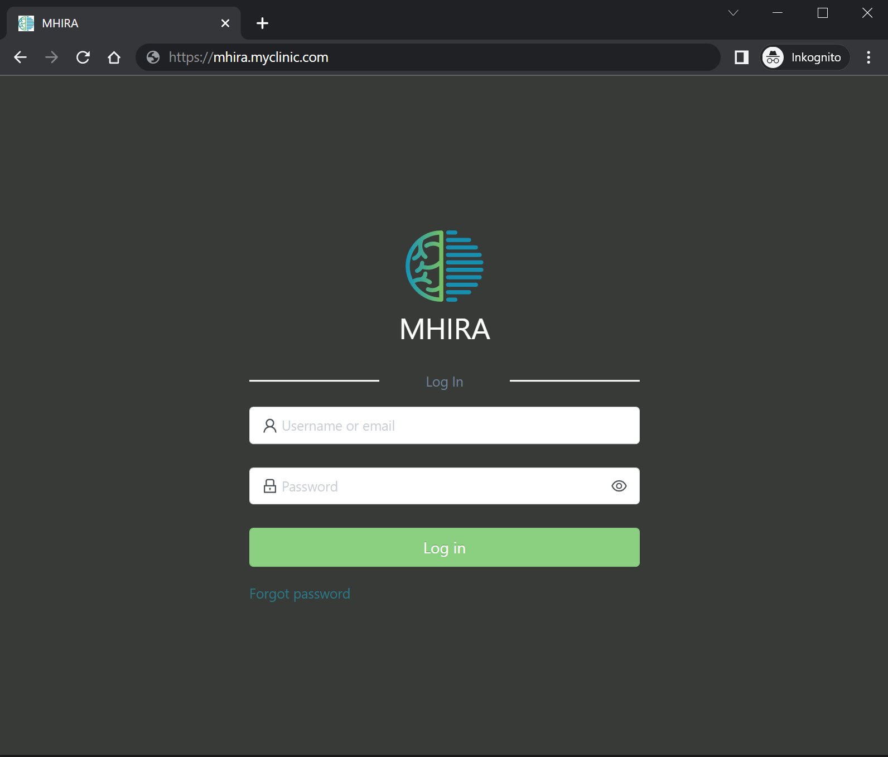

# Access

## MHIRA is a web application

MHIRA is accessed via your internet browser (e.g., chrome or firefox). 
Use the address bar of the browser to enter the URL of MHIRA at your organisation. 

||
|:--:| 
| The format of the URL will be something like: https://mhira.myclinic.com. |

:::note
This URL needs to be provided to you by your organisation. 
You might also need to be connected to the right network for access e.g., Virtual Private Network or your organisation's intranet.  
:::

## Username and password

The manager of the software will provide you with a username and a temprorary password. 
At first login, you will need reset your password. 

:::tip
Using your usual or weak passwords might put the patient data at risk. 
Consider using a password manager e.g., [roboform](https://www.roboform.com/). 
This tool will help you genereate strong passwords. It can also remember them for you making access to MHIRA more conventient.  
However, please consult the person managing MHIRA on whether this is in line with the regulations at your organisation. 
:::

:::warning
Do not share the password for any reason. If someone else needs access to MHIRA, this person can obtain an account from the person in charge for MHIRA.
:::

## I don't remember my username or password

Please contact the person managing the users in MHIRA. You cannot reset the password by yourself.