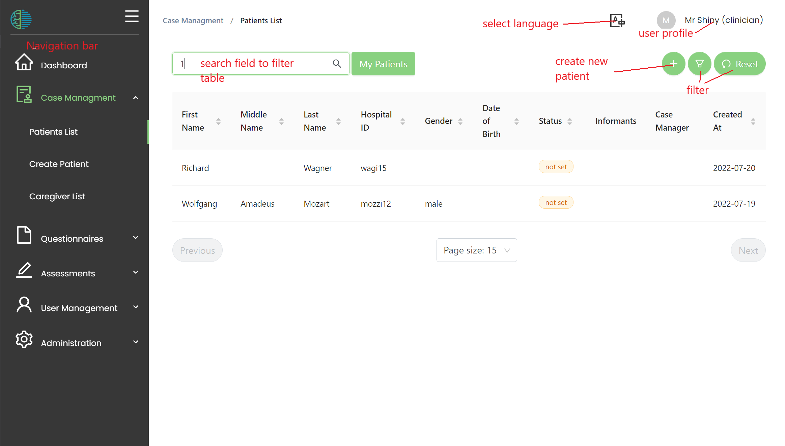
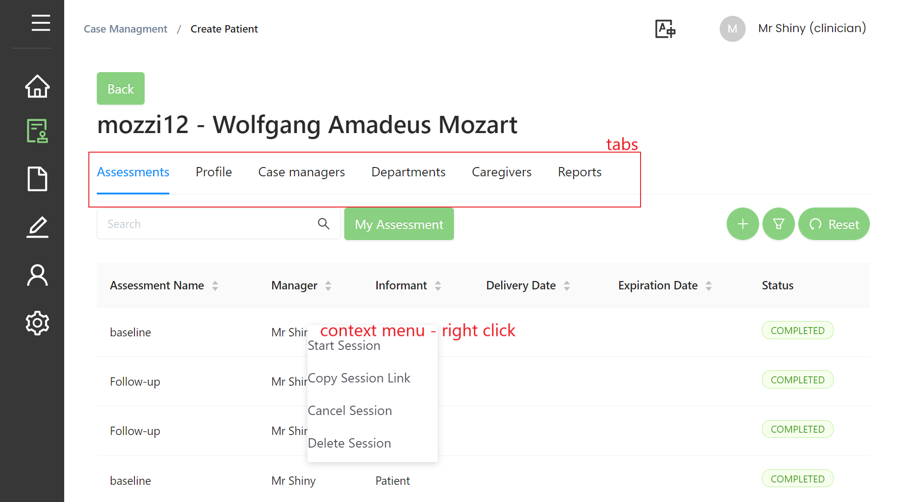

# Navigation

- Use the navigation bar to access MHIRA's different features like *case management* or *questionnaire management*.
- MHIRA has differnt languages available. You can change the lanuage by clicking the lanuage symbol.
- In the user profile, you can logout, view your user's settings or change the password.  
- The search field can be used to filter entries in the tables, e.g., the patient table can be filter by last name.
- More specific filters can be found clicking the filter button. The filters can be removed with the reset button. 
- The **+** is used to add entries to the table, e.g., a new assessment or patient. 

:::warning Use right click
Use right click to open the context menu of a table entry. (On tablet this might be long press or two-fingers press). This will show additional functionality regarding the table entry. (see image below)
:::

- Some features have tabs allowing you to access different sub-composnents (e.g., patient-profile or patient-assessments).
- The navigation bar can be minimised in case you need more space. Hovering the symbols will show the sub-entires. 

:::note Permissions

If certain features are not available or you cannot make changes, this might mean that you do not have the required permissions. 
You can see your assigned user roles from the user profile. 
Contact the user manager if you need additional permissions. 

:::