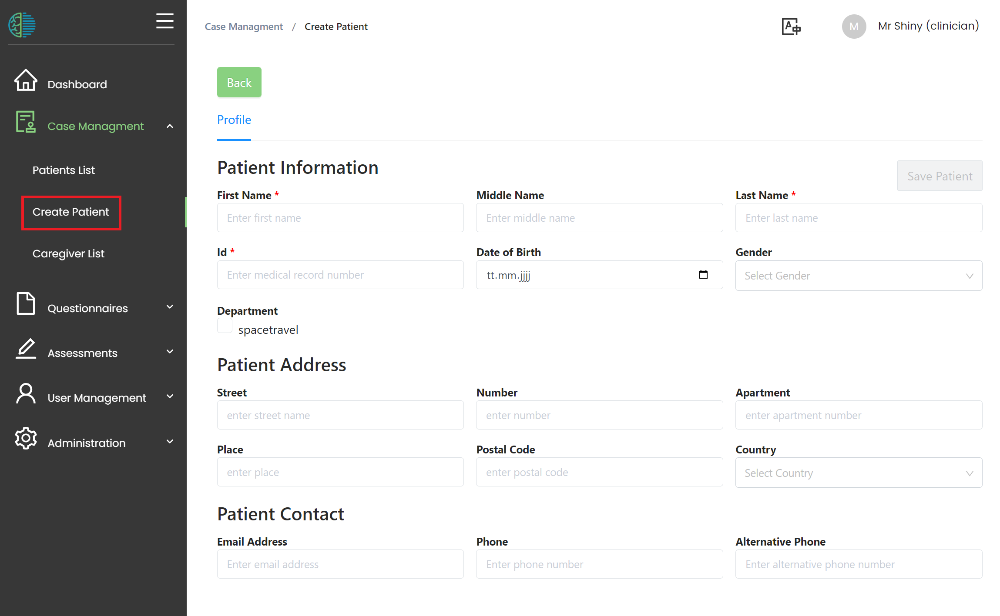
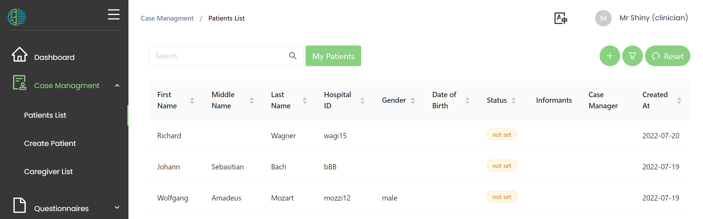
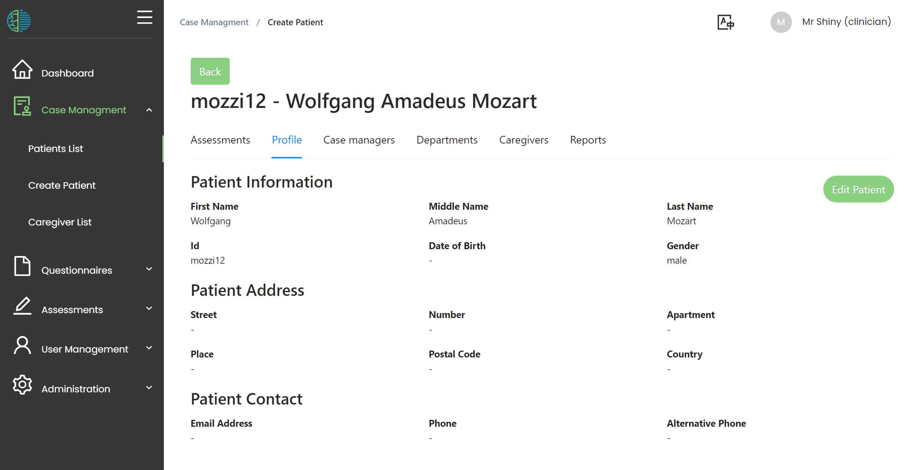

# Patient Management 
MHIRA is conceptualised as an electronic health record centred around cases (i.e., patients). By creating a patient entry, the mental health care workers can access all the information about their patient in one site. 

## Creating a new patient

To create a patient, the “create patient” button needs to be clicked. This will prompt the user to fill in the patient's profile.

- The profile contains identifying information about the patient as well as means to contact the patient. The fields marked by an asterisk (*) are mandatory. 
- A patient needs a department to be created. 

:::note
Only the departments of the created users can be selected. Consequently, users without any department cannot create patients.
:::

- Press the **save patient** button to create the patient.

## Patient overview table

All registered patients can be found in the patient overview list. 

Left click on a patient entry in the list will bring you to the patient centred view. 
Right click will open the context menu allowing for actions like deleting the patient (permission required) or setting the current status of the patient.

:::tip
the **My patients** button will reduce the table entriesto those patient for which you are assigned as [case manager](4-patient-management.md#case-manager)
:::

:::note Access to patients
You can only view patients who are assigned to your departments. If you do not find a patient, make sure that you share a department with this patient. 
:::

### Deleting patients

To delete a patient, open the context menu (right click on the patient), then select **Delete patient**. Finally, you will need to confirm this action. A special user permission is required for this action.  

### Patient status

A patient status can be set in the patient overview list. 
This can help you and your team to understand which stage of the clinical process the patient is currently in. 

To set a patient status, use right click on the table to open the context menu.

Then, select a patient status and click 'OK'

:::tip
If you need different status options (drop down choices), ask the person in charge of setting up MHIRA. 
They can easily add or remove status options. 
:::

## Patient-centred view

The patient-centred view can be accessed by selecting the corresponding patient from the patient-overview list (left click on the entry). 

The patient-centred view (or patient detail view) presents with tabs which will give access to different functionality regarding the patient:

### Profile

Here the information regarding the patients can be viewed or edited. 
Use the edit button to make changes. 

### Department
Each entered patient needs to have at least one department. A patient can be assigned to multiple departments. Users can only see patients with which they share a department constituting MHIRA’s system for restricting access to patient files to relevant users.  
Basically, the department tab allows you to manage which users of MHIRA have access to the patient (e.g., referral to another department).
Departments can be removed using the context menu (right click) and added using the **+** button. 

### Case Manager 
Casemangers can be optionally assigned to a patient. This can be used to track the staff members involved in the management of the patient and clarifying responsibilities within the clinical team. In overview lists, clicking on “My patients” will filter the list of patients down to those for which the user is a case manager. 

### Caregivers
The MHIRA project is primarily aimed at child and adolescent mental health. Additionally, focus groups showed that patients in LMIC are usually accompanied by family members. It was considered important to be able to document emergency contacts and other caregivers. Under the menu caregivers on the patient-centred view, such persons can be documented for each patient. This might include family members, health professionals without access to MHIRA, legal advisors, teachers, etc.  For a particular patient, the relationship between the patient and the caregiver is defined by a dropdown selection (e.g. mother). Emergency contact can be set to true or false to signal that a certain caregiver should be contacted in emergency situations. Finally, a ‘notes’ field can be used to detail the specifics on the caregiver relation.
The phone number of the caregiver acts as a unique identifier and can be used to search existing caregivers to assign them to more cases.

:::note
As a given caregiver can be associated with multiple patients, the caregivers are stored in a general database table and then assigned to one or multiple patients. In case contact information needs to be changed, this will come to effect for all patients with a given caregiver. These changes can be made in the care giver menu accessible from the navigation bar. 
:::

