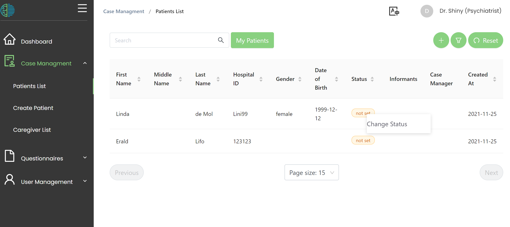
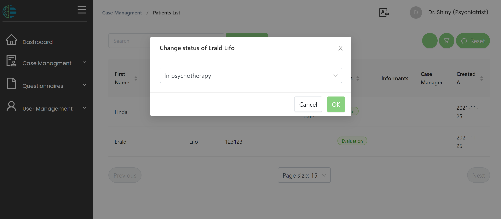

# Patient Management 
MHIRA is conceptualised as an electronic health record centred around cases (i.e., patients). By creating a patient entry, the mental health care workers can access all the information about their patient in one site. The patient-centred view can be accessed by selecting the corresponding patient from the patient overview list.  The patient-centred view contains the subsections profile, departments, case managers, departments, caregivers, assessments and reports. To create a patient, the “create patient” button needs to be clicked. This will prompt the user to fill in the patient's profile.

## Profile 
The profile contains identifying information about the patient as well as means to contact the patient. In our international group, we defined a number of required fields for each patient entry as a consensus: name, last name, and ID (e.g., the hospital ID or other identification number). Additionally, age and gender can be added. Finally, to complete the profile, the patient’s address and contact details (phone and email) can be entered.  
Department
Each entered patient needs to have at least one department. A patient can be assigned to multiple departments. Users can only see patients with which they share a department constituting MHIRA’s system for restricting access to patient files to relevant users.  

## Case Manager 
Casemangers can be optionally assigned to patients. This can be used to track the staff members involved in the management of the patient and clarifying responsibilities within the clinical team. In overview lists, clicking on “My patients” will filter the list of patients down to those for which the user is a case manager. 

## Caregivers
The MHIRA project is primarily aimed at child and adolescent mental health. Additionally, focus groups showed that patients in LMIC are usually accompanied by family members. It was considered important to be able to document emergency contacts and other caregivers. Under the menu caregivers on the patient-centred view, such persons can be documented for each patient. This might include family members, health professionals without access to MHIRA, legal advisors, teachers, etc. As a given caregiver can be associated with multiple patients, the caregivers are stored in a general database table and then assigned to one or multiple patients. In case contact information needs to be changed, this will come to effect for all patients with a given caregiver. The phone number of the caregiver acts as a unique identifier and can be used to search existing caregivers to assign them to more cases. For a particular patient, the relationship between the patient and the caregiver is defined by a dropdown selection (e.g. mother). Emergency contact can be set to true or false to signal that a certain caregiver should be contacted in emergency situations. Finally, a ‘notes’ field can be used to detail the specifics on the caregiver relation.

## Patient status

A patient status can be set in the patient overview list. 
This can help you and your team to understand which stage of the clinical process the patient is currently in. 

To set a patient status, use right click on the table to open the context menu.

Then, select a patient status and click 'OK'

:::tip

If you need different status options (drop down choices), ask the person in charge of setting up MHIRA. 
They can easily add or remove status options. 

:::

