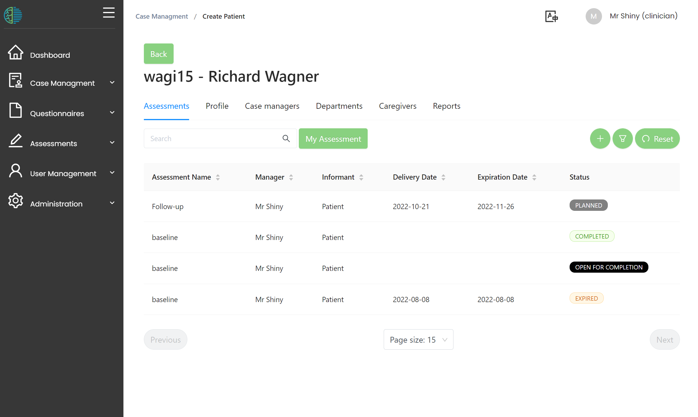
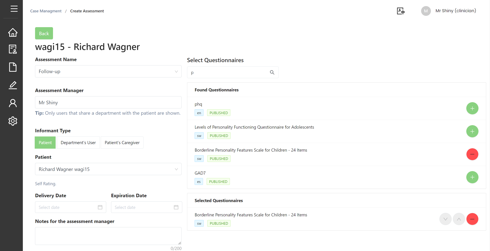
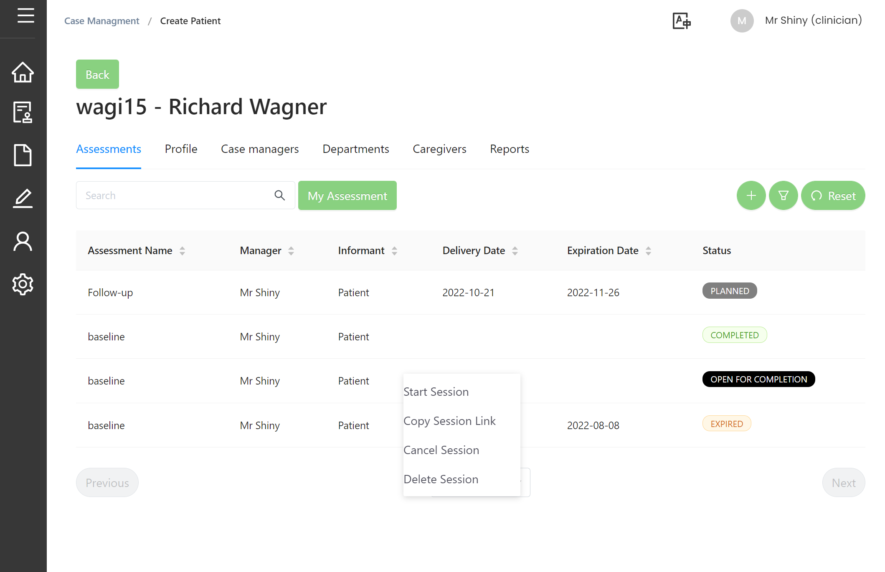

# Assessments

:::note What is an assessment in MHIRA?

Assessments are sessions in which information about a patient is collected. 
The information can be collected in form of self-rating questionnaires, third person questionnaires or clinical interviews. 
Assessments bundle a number of questionnaires or forms to be filled in by an informant. 

:::

## Prerequisites

Assessments are part of the [core workflow in MHIRA](1-introduction.md#and-how-does-it-work) which aims at facilitating the use of psychometric instruments (evidence-based assessment). After [questionnaires have been uploaded](./../3-guide-for-admins/9-questionnaires.md) and a [patient has been created](4-patient-management.md#creating-a-new-patient), 

## Assessments on the patient-centred view

### Assessment status

Assessments can have different statuses:

- Completed: All required fields of the questionnaire have been collected and the questionnaire has been submitted
- Partially completed: At least one item has been answered, however, the questionnaire has not been submitted. 
- Open for completion: The questionnaire can now be completed.
- Planned: The delivery date for the questionnaire is in the future. When that time arrives, the status will change to 'open for competion'.
- Expired: The expiration date has been reached, the assessment can no longer be filled. 
- Cancelled: The assessment was manually cancelled. This can be done using the context menu (right click). 

## Creating an assessment

Assessments can be created from the [patient centred-view](4-patient-management.md#patient-centred-view) using the **+** button, or, alternatively, the ‘plan assessment’ menu accessed from the navigation bar. 

### Select a title (mandatory)
To create an assessment, it needs a title (e.g., ‘baseline’ or 'follow-up'). The available titles will be set by the person managing MHIRA at your service and can be selected using a drop-down menu.

### Select one or multiple questionnaires (mandatory)
Start typing in the search field to serach the available questionnaires. 
Press on the **+** next to the questionnaire names in the 'found questionnaires' box to add this questionnaire to the 'selected questionnaires' box. 

### Add an informant (mandatory)

Informants can be of 3 types:
    1) The patient himself/herself using a self-rating questionnaire,
    2) a user of the MHIRA software which applies if expertise from another health care worker is required, or
    3) a caregiver whose relation with the patient can then be selected from a dropdown. 

### Delivery date (optional)

Delivery date can be selected to block the assessment until it's desired time of execution has come. 

### Expiration date (optional)

If an assessment is no longer useful after a certain timeframe, an expiration date can be set. After this date, the assessment is no longer available. 

## Starting an assessment session

If the status of the assessment is ‘open for completion’ or ‘partially completed’, the assessments can be accessed via a link.

:::note 
Filling in questionnaires does not require a user to be logged in. Thus, these links can be opened by the patient at home or be accessed in the waiting room. 
:::

Assessments are started from the context menu (using right click) in the assessment tab (see picutre).

 
The link can be opened in the same browser. Alternatively, it can be manually sent by email or other means (e.g. messengers) to the informant of the assessment.

