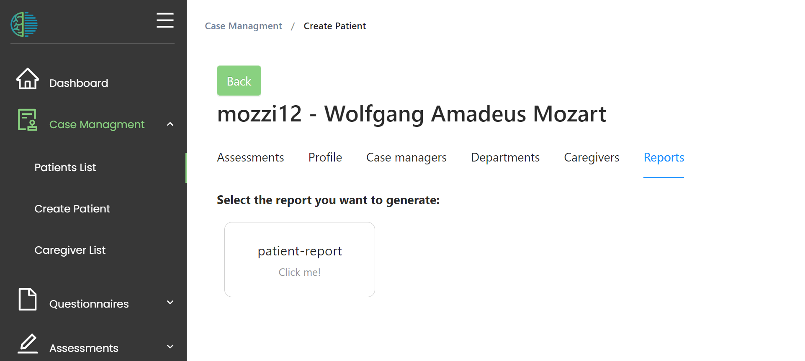
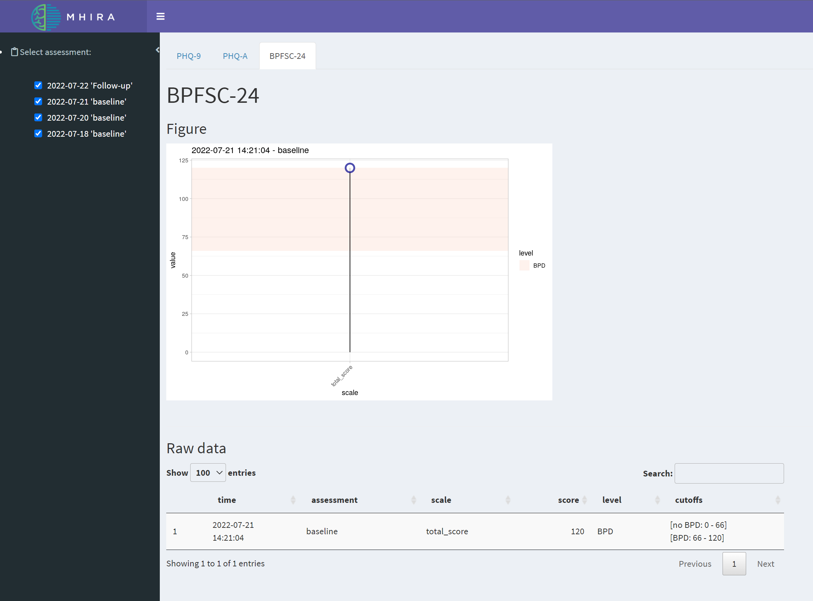
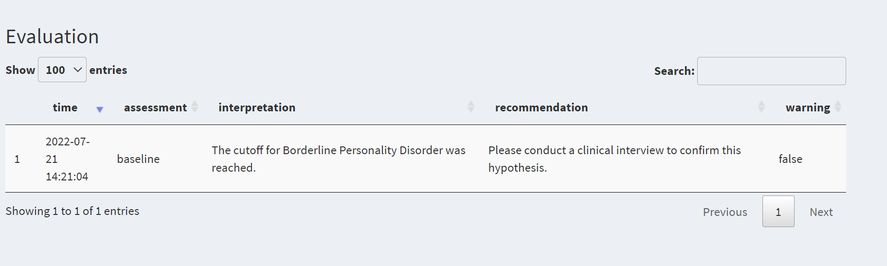
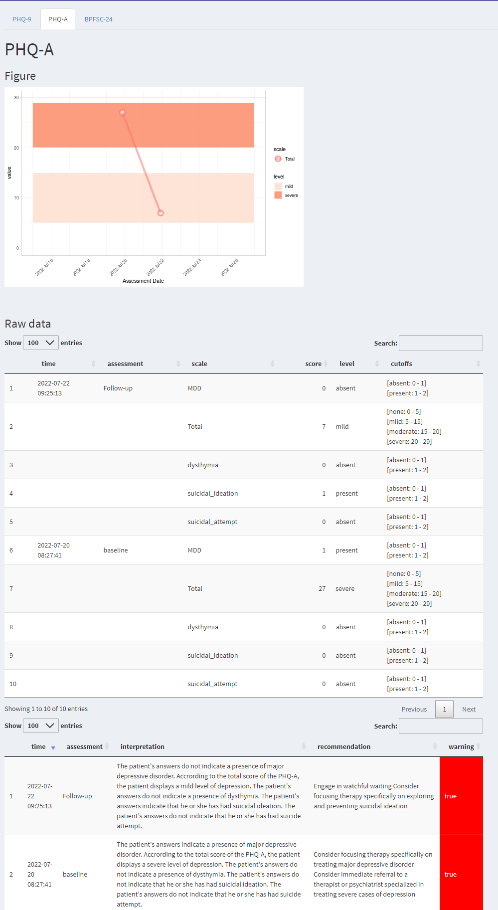

# Reports 

Now that questionnaire data has been collected, the mental health care worker can proceed to access a report on the collected data. As an example, this could be the calculated scales of a given questionnaire represented as a graph which also shows the likelihood of the results compared to healthy control subjects. In case of repeated measures, the graph could show the severity of symptoms over time. A report could also link to psychoeducation materials or suggest treatments or further assessments based on the obtained results. 
From a user perspective, obtaining a report is done by pressing a reporting button in the reporting section of the patient centred view. This action will open a new tab in the browser. The report is not generated by MHIRA, but is instead generated by an external application like R. MHIRA does not contain any specific reports as it is conceptualised as a platform to which questionnaires and reports can and need to be added. 

## Example of a report

1. Navigate to a patient profile in MHIRA.

2. Select the "Report" tab.

||

3. Click 'the patient-report' button to obtain your patient report

||
|:--:| 
|The patient report will show all completed questionnaires of the patient. The questionnaires are represented in tabs. The scales of the questionnaire will be automatically calculated and the cutoffs will be provided. This allows judging the severity of the impairment.|

||
|:--:| 
|The reports also provide an interpretation in text form for each assessment.|

||
|:--:| 
|If multiple assessments of the same type were collected, the report switches to repeated measures mode and shows the trajectory of the symptom scales.|
