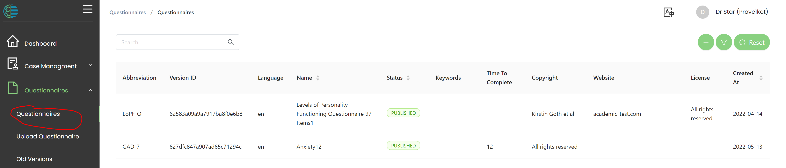

# Questionnaires 

## Creating an xlsform
Adding questionnaires in MHIRA is based on the [xlsfrom](https://xlsform.org/) which is a standard format for authoring forms. 
The first step is to create an excel file with the specification of the xlsform format to represent the questionnaire you would like to add to MHIRA. 
To create this excel file, please follow the instructions on the [xlsform guide](https://xlsform.org/) (external to our project).

:::caution
Xlsform is a sophisticated format aimed at research. For MHIRA, we have only implemented a limited set of features useful to cover most mental health questionnaires. We will add more features in the future as needed. The current document details the available features.
:::

 In short, your excel file will need 3 worksheets:
1. [The survey worksheet](https://xlsform.org/en/#the-survey-worksheet): is a list of the questions of the questionnaires.
2. [The choices worksheet](https://xlsform.org/en/#the-choices-worksheet) is used to set the answer options (e.g., for multiple choice type questions).
3. [Settings worksheet](https://xlsform.org/en/#settings-worksheet): is used to set meta data about the questionnaire.

### Available question types

[Here](https://xlsform.org/en/#question-types) you can find a list of question types available in xlsform format.  

:::info
MHIRA currently offers the following question types:
- text
- decimal
- [Multiple choice](https://xlsform.org/en/#multiple-choice): *select_one* and *select_multiple*
- checkbox
- date
- time
- dateTime
:::

### Other specifics to MHIRA xlsform implementation

- Simple  [grouping of questions](https://xlsform.org/en/#grouping-questions) of questions is available in MHIRA. *Please note that begin_group and end_group are required in MHIRA*. 
- [Skipping](https://xlsform.org/en/#skipping) is available. 
- Questions can be set to be [required](https://xlsform.org/en/#required). However, required messages do not currently work.
- [Constrains](https://xlsform.org/en/#constraints) are currently not implemented.
- [Multi-language support](https://xlsform.org/en/#multiple-language-support) is not implemented. You will need to create multiple xlsfoms and set language in the MHIRA user interface. This change is due to how reporting works in MHIRA. 

:::warn
Make sure required items are set to 'required' in the xlsform as
failing to do so will likely later result in incomplete reports. 
:::

### Unique identifier for questionnaires.

:::tip
On the [settings worksheet](https://xlsform.org/en/#settings-worksheet), the field *form_id* will be used as the unique identifier for your form. You can only have one form with a given form ID per language (i.e., you can use the same form_id for different languages) in your MHIRA instance.  This field will serve as the abbreviation of the questionnaire.
:::

### Validating your xlsform

You can use [this website](https://getodk.org/xlsform/) to validate your forms. This will indicate any violation of the format. 

## Uploading your xlsform to MHIRA to create a questionnaire

To upload your questionnaire to MHIRA, please select “upload questionnaire” from the navigation bar. 

1. Select your *xlsform* on your local drive to upload it with the “choose file” button.
2. Provide a long name for your form. 
3. Select a status (this field has no impact on the behaviour of the software, but the field is required)
4. Select a language
5. Provide copyright information
6. Feel free to provide keyworks, link to a website or describe license terms. 
7. Finally, click “Upload Questionnaire” which is accessible by providing the mandatory information (marked with the red asterix). 

:::note
*Uniqueness of questionnaires*

It is not possible to upload the same questionnaire multiple times. An attempt to do so will result in an error.  
The unique identifier consists of a combination of:
1. The abbreviation which is set via the from_ID column in the [settings worksheet](https://xlsform.org/en/#settings-worksheet) of the xlsform
2. The selected language (making it possible to have the same questionnaire in multiple languages)  

If you want to update the questionnaire xlsform, you will need to archive the questionnaire and upload it again.
:::

Currently, there is no viewing of the uploaded questionnaire in the questionnaire menu. Please start an assessment with the questionnaire to check how it looks. 

## Questionnaire list

The uploaded questionnaires are listed under the “questionnaires” menu accessible from the navigation menu. 

- Left mouse click on a questionnaire in the list will bring you to the questionnaire detail view in which you can edit the questionnaire fields. You cannot change the uploaded xlsform. This requires archiving the questionnaire and re-uploading it. 
- With the right mouse click, you open the context menu allowing you to archive the questionnaire (provided you have the permission to do so). 

 ##  Old versions of questionnaires

When a questionnaire is used in an assessment, the data collected with the questionnaire is linked to the currently active questionnaire version (the one listed in the questionnaire list with status “published”). When you update or archive a questionnaire, the *old version* of the questionnaire is kept in the database. It will never be deleted.  This way, questionnaire answers can always be linked to the questionnaire version used. The old versions are listed under the menu “old versions” in the navigation bar. 
