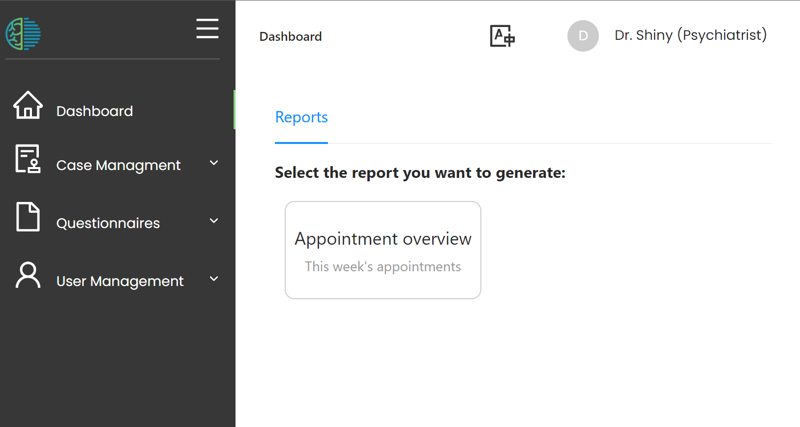
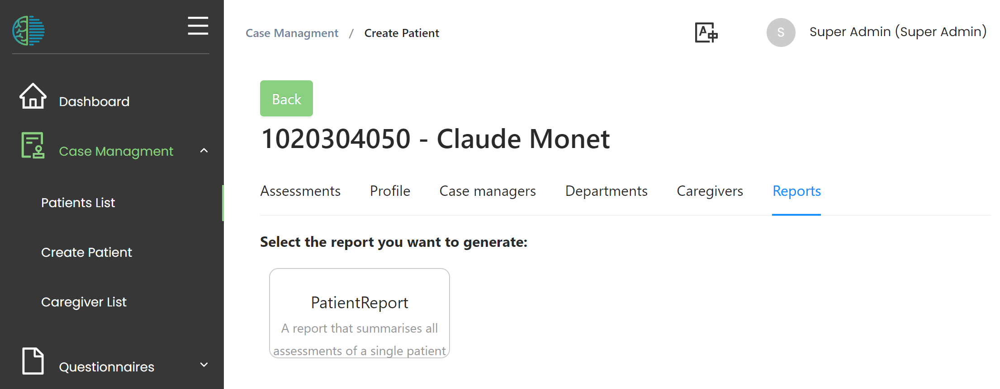
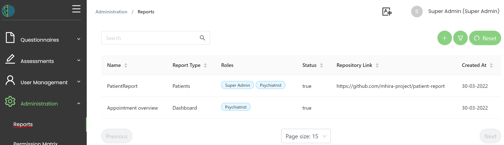
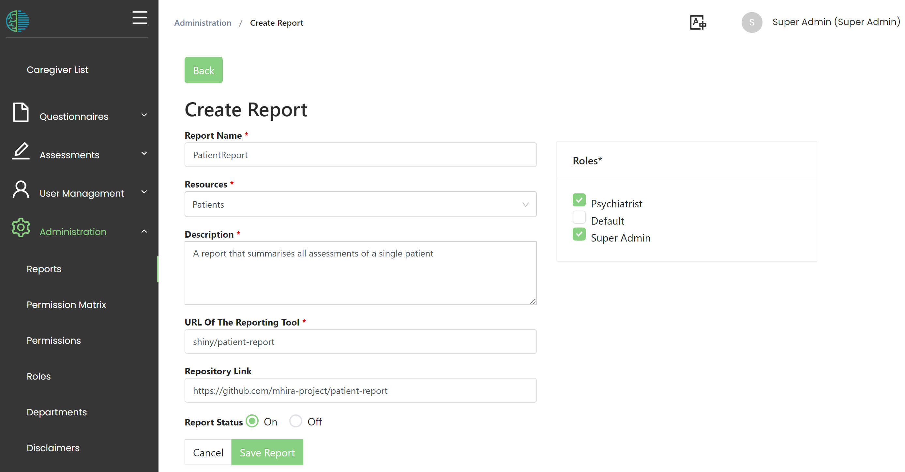

# Reports

The 'reports' menu which is accessible under 'Adminstraion' allows to set up **reporting buttons** in the MHIRA software. 
These reporting buttons will trigger the creation of reports for different purposes. 

:::tip

To understand the current section, it might be helpful to first read up on [how reports work in MHIRA](https://mhira-project.github.io/documentation/docs/mhira-reporting-guide/overview).

:::

In this menu we will link a button that is dynamically created in MHIRA to a reporting app. 

Currenlty, these 'reporting buttons' can be created in two locations:

- On the dashboard

- In the patient detail view under the 'reports' tab

## Create buttons

To create these buttons, navigate to the 'Reports' menu which is accessible under 'Adminstraion' via the navigation sidebar. 

Under this menu, a table  will show all buttons currenlty set up. 

To added an existing entry, left click on this entry and then select 'Edit'.

To create a new reporting button use the '+' button above the table. 

Here is what the editing mode will look like:

- A report name needs to be entered. This name will be shown on the button. 
- A resource needs to be selected. This defines the locatin of the button, either on the patient detail or on the dashboard. 
- The description will also be shown on the button. 
- URL of The Reporting Tool is the url under which the reporting tool is accessible. Only the part of the URL after the MHIRA URL (the one you enter to access MHIRA) needs to be provided. In the provided example, the URL part 'shiny/' will give you access to the shiny server that is installed with MHIRA. And 'patient-report' is the name of the shiny app running on this server. 
- Select roles who have access to the report. The buttons will not be shown to users that do not have these roles. 
- Repository Link is optional and can help document where the reporting app was obtained. 
- Finally, switch the reporting button on and off with the Report Status   