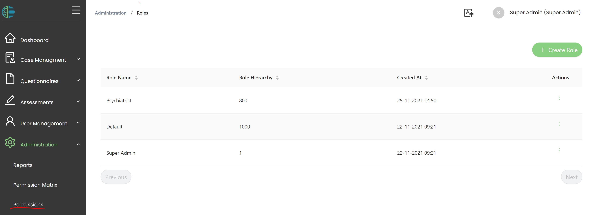

# User roles

User roles are a way to conventiently bundle a set of permissions. By assinging a user role to a user, this user will obtain all the permissions linked to the role. 

:::note
- First, we will create user roles.
- In a second step, we will link [permissions](https://mhira-project.github.io/documentation/docs/guide-for-admins/permissions) to these user roles. 
- Finally, we will [create users](https://mhira-project.github.io/documentation/docs/guide-for-admins/users) who will get one or multiple user roles. 
:::

## Creating user roles

To create user roles, please use the navigation bar
to nagigate to the 'Roles' menu under 'Administration'.

The 'default' role is the role that users get when their account is created. By default, this role does not have any permissions and we recommend leaving it that way. 
The other pre-existing role is [superadmin](https://mhira-project.github.io/documentation/docs/guide-for-admins/superadmin).

To create a new role, press the 'Create role' button.

Please enter a name for the role and enter a hierarchy number, then press save. 

:::tip

## Hierarchy
This  number is used for user roles that have the permission to manage other users. 
Numbers between 2 and 1000 can be selected. 

**Users can only modify users with a higher number.** 

Consequently, users cannot change their own profile.
Superadmin has the number 1 and can, thus, not be changed by any other user. 

:::

To delete a role, use right click or open the context menu from the actions button in the table rows. 
Please note, that a deleted role is no longer available to users with this role.

## Examples of roles could be:
- Psychiatrist
- Nurse
- Frontdesk (someone creating patients but without access to assessments)
- Usermanager
- Administrator

