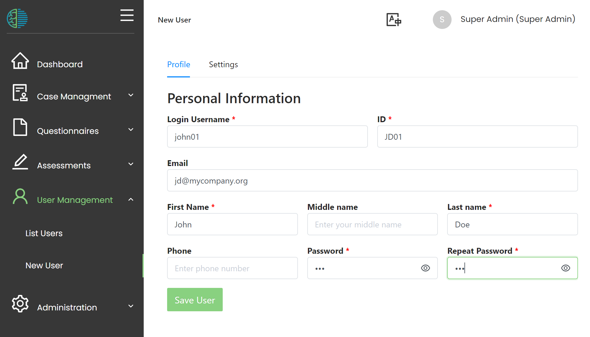
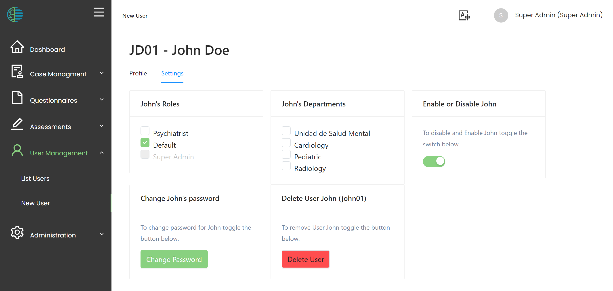

# Users

Users will need an account to access MHIRA. 
These cannot be created by the user themselves. However, they need to be created by a user with permission to manage users. 
This procedure was selected to allow a maximum of control over who has access to the platform. 

## Creating user accounts
The user accounts are set up from the 'User Management' menu accessible from the nagigation sidebar. 
The nagivation menu contains the entry 'New User' which can be used to start creating a new user. 
Alternatively, the process can be triggered from the user list using the '+' button. 

In a first step, the user's profile needs to be filled in. 
Fields with a * are mandatory. 
After filling in these fields, the 'save' button becomes available. 

The password needs to be repeated. The set password is temporary as the user will be forced to reset his/her password at first login.
The password needs to be communicated to the user by a channel outside of MHIRA, e.g., a paper printout, via telephone or by email. 

:::tip
Some browsers have the possiblity to auto-generate stong passwords. 
:::

After filling in the required fields, the 'save' button becomes available. Once pressed, the user account has been created. 

## User settings

In a next step, some settings need to be made. 
By default, the user can access mhira but he will not have any permissions or access rights.

To grant permissions, one or more user roles need to be selected. We recommend unchecking the default user role.
Additionally, one or more departments can be selected, depending on whether the user needs access to patient entries or not.  

Additionally, the user manager can force a password reset by setting a new password. 
It is also possible to deactivate the account.
Finally, an account can be deleted. 

:::note

**Sometimes, options are not available (they appear greyed out):**
- The 'manage users' permission is required. 
- Without the permission to delete users, the delete button is not accessible. 
- User roles with a lower or equal hierarchy to the own value cannot be given to other users.
- User accounts with a lower hierarchy value cannot be modified. 

:::

