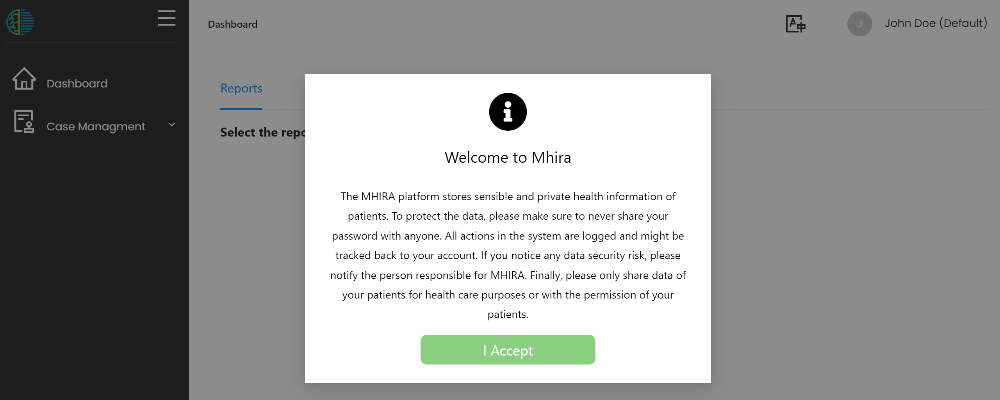
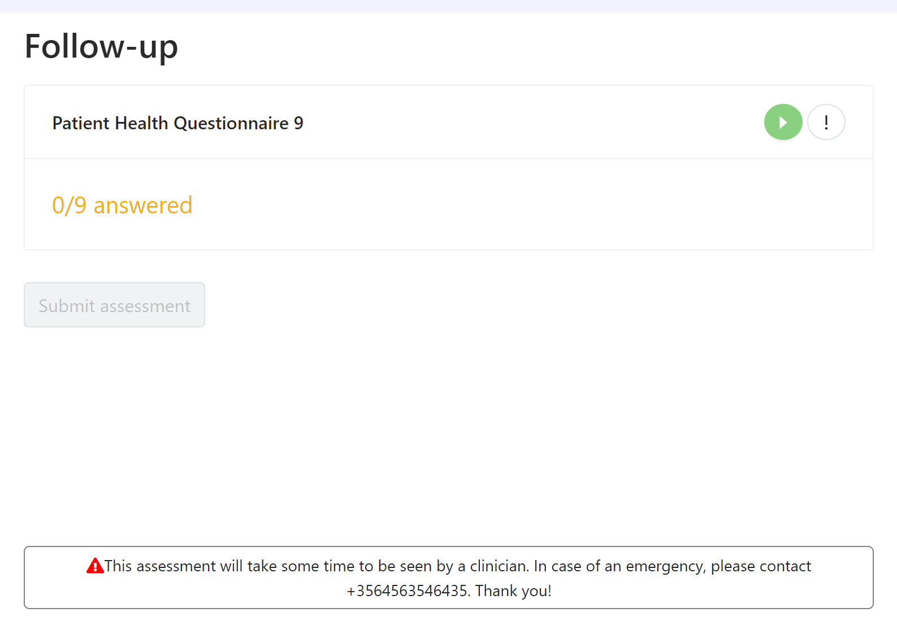

# Messages and disclaimers

Messages can be important to inform informants (those filling in questionnaires) and users of MHIRA. 
Sometimes, they are required as legal disclaimers. 

A message will be shown at first login of every user. 

A second message is shown when informants (e.g. a patient) is filling in an assessment. 

Both these messages need to be set under the 'message' menu accessible in the navigation menu under 'administration'.

