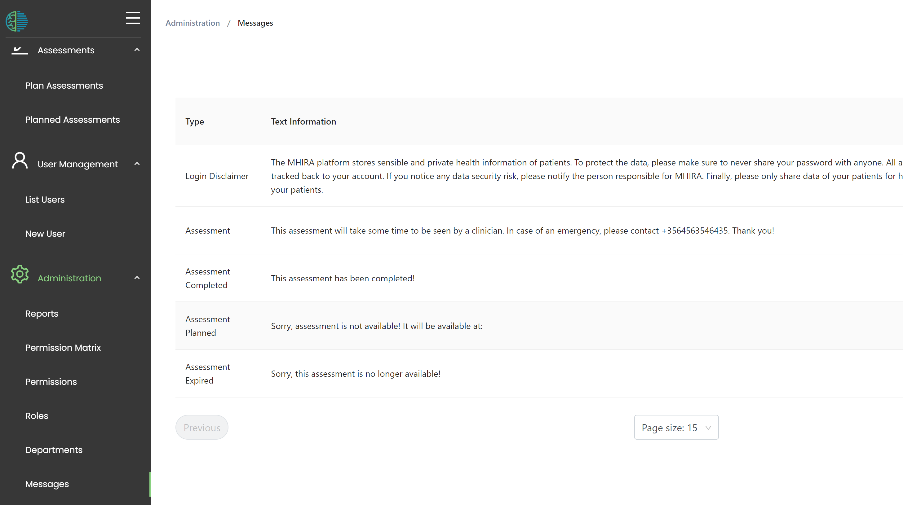

# Messages and disclaimers

Messages can be important to inform informants (those filling in questionnaires) and users of MHIRA. 
Sometimes, they are required as legal disclaimers. 

You can set the messages under the **Message** menu accessible in the navigation menu under **administration** shown in the picture

## Login disclaimer

A message will be shown at first login for every user. 

## Assessment

A  message is shown when informants (e.g. a patient) are filling in an assessment. 

## Messages for qustionnaire links

MHIRA allows to send questionnaire links. 
These links can be 'open for completion' in which case the questionnaires are accessed with the link. This will lead the user to the view shown in the previous section. 

However, 
- if the assessment is 'completed', the 'Assessment completed' message will be shown. 
- if the assessment is 'cancelled' or 'expired' the 'Assessment expired' message will be shown
- if the assessment is planned (not yet available because it is set for the future), the 'Assessment planned' message will be shown. After this message, the date at which the assessment becomes available is shown. 

:::tip
Please set these messages according to your needs. 
:::
