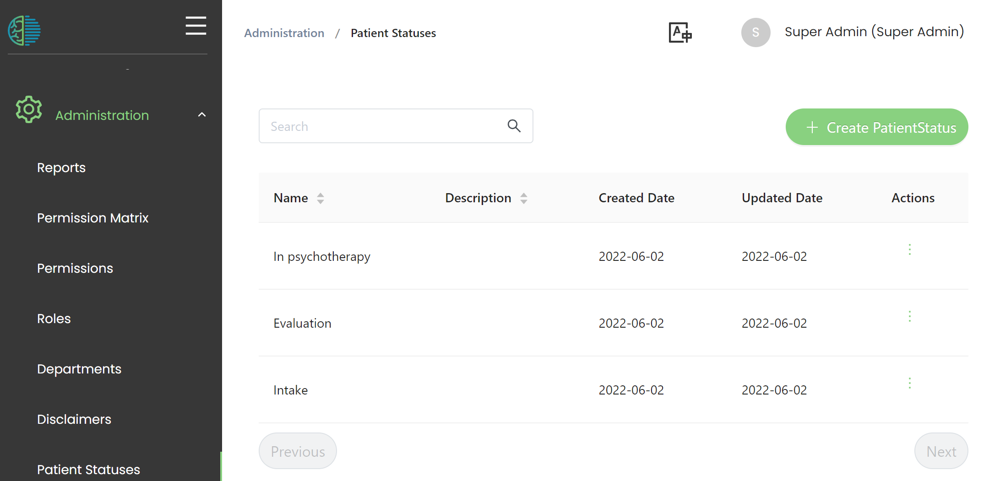

# Patient status

Patient status is a feature that can support the workflow and collaboration. 

In the patient overview list, a status field can be set to indicate in which stage of the clinical process the patient currently is. It might also be used to indicate required actions. 
The definition of the statuses is up to the clinical management and needs to be set according to the service's clinical and administrative processes. 

:::note

From a user perspecitve, this setting will have effect [here](https://mhira-project.github.io/documentation/docs/user-manual/patient-management#patient-status)

:::

## Defining patient status dropdown choices. 

To set the available options for patient status, please use the 'Patient Statuses' menu accessible through the navigation bar under 'Administration'

