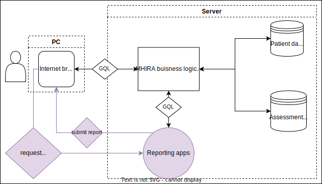

# Overview

With the flexibility regarding questionnaires, MHIRA is confronted with the challenge of flexible and adaptive reporting. MHIRA’s strategy to address this issue is leveraging available data science tools like those available in the R (e.g., ggplot, tydiverse and shiny) and Python (e.g., pandas and dash) programming languages. 

This flexibilty requires some knowledge about how these data science tools work. However, it also offers the possiblity to create reports which go far beyond what can be normally achieved for clinicans. The idea here is to make data science available in clinical practice. 

As MHIRA is installed in the form of orchestrated docker containers running different modules of the software, software used for reporting can be added to the system of containers with docker-compose. Official docker images of 'data science' software in different configurations are available at the [Docker Hub Container Image Library](https://hub.docker.com/). As a first approach, we are getting started with a shiny server and the programming language R to generate our MHIRA  reports. 
The shiny server and also a RStudio containers come as part of the package when MHIRA is [intalled](https://mhira-project.github.io/documentation/docs/installation-guide/installing-mhira). 

## How it works

||
|:--:| 
| *GQL = GraphQL (query language). Non-coloured: MHIRA operations (without reporting). Coloured: Mechanism for reporting.* |
 

The figure shows a schematic and simplified overview of how reporting tools interact with the MHIRA business logic:
- When using MHIRA without a report (e.g., creating a new patient) the user will interact with the MHIRA front-end. The front-end will perform the create, read, update or delete action via GraphQL queries or mutations. The MHIRA business logic will then check the user’s permission to obtain information and interact with the databases. A response is then sent back to the front-end.
- **Reporting** is represented in colour in the figure: The administration menu in MHIRA allows for [generating buttons inside the MHIRA user interface](https://mhira-project.github.io/documentation/docs/guide-for-admins/reports) which can be assigned to certain roles and be placed in different views (i.e., the dashboard and the patient centred view in the reporting tab). Pressing these buttons (e.g., by a health care worker) will open a new browser tab and send a request to an URL which needs to be defined as that under which the reporting tool can be accessed. A URL parameter points towards the patient for whom the report is requested. With this request, the reporting apps also receive a temporary authentication token which serves to identify the user from whom’s session the report request was triggered. The reporting app will then request the required data from the MHIRA business logic via GraphQL query language and provide the token to authenticate the request. Once the data is obtained, the reporting apps will proceed to build the report and send it to the user’s browser tab.   
