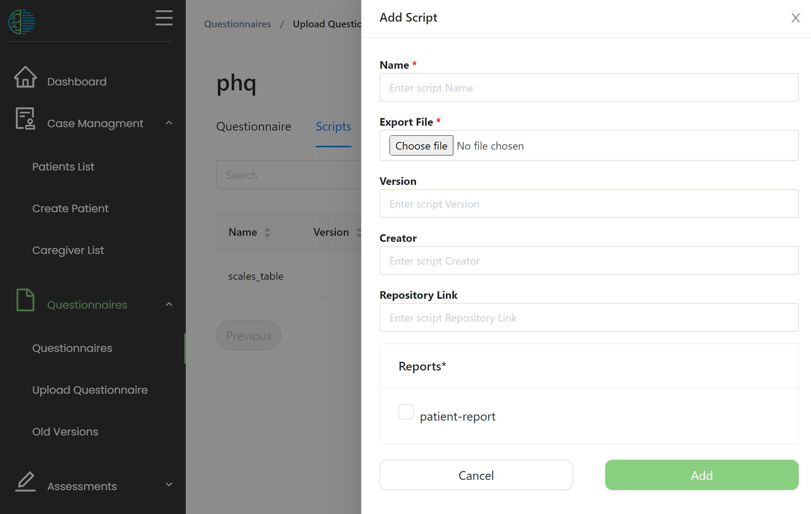

# Patient-report shiny app

:::tip
Please consult ['using shiny apps for reporting'](5-using-shiny-apps-for-reporting.md) for more background information. 
:::

The patient-report shiny app serves as a patient data reporting tool for the Mental Health Information Reporting Assisitant (MHIRA).  

:::note
This documenation refers to [this repository](https://github.com/mhira-project/patient-report)
:::

## What is the patient report?

[Click here for an example](../2-user-manual/6-reports.md#example-of-a-report)

## How to make the patient report work with MHIRA


### Installing the app to work with MHIRA:

You can clone the app to the [folder inside the shiny server](5-using-shiny-apps-for-reporting.md) using 

    git clone https://github.com/mhira-project/patient-report.git


### Updating the app

For updating the shiny app, navigate inside the folder containing the app and use 

    git pull

### Adding algorithms for sales and cutoffs for the questionnairs

For the patient-report to work you will need to provide information on how to calculate scales and on the cutoffs for these scales.

For example the questionnaire [PHQ-9](https://www.apa.org/depression-guideline/patient-health-questionnaire.pdf) which evaluates depressive symtoms presents with a "Total Score" which is the sum of the scores for its 9 items. PHQ-9 also has [cutoff points](https://bmcpsychiatry.biomedcentral.com/articles/10.1186/s12888-019-2262-9#:~:text=Regarding%20severity%2C%20PHQ%2D9%20comprises,severe%20depressive%20symptoms%20%5B25%5D.): It comprises five categories, where a cut-off point of 0–4 indicates no depressive symptoms, 5–9 mild depressive symptoms, 10–14 moderate depressive symptoms, 15–19 moderately-severe depressive symptoms, and 20–27 severe depressive symptoms. 

We need to provide this information to the patient-report:
To this aim, files containing this information can be [uploaded together whith the questionniares](../3-guide-for-admins/9-questionnaires.md) under the 'script tab' in the 'questionnaires' menu (accessible from the navigation bar).




:::note

Any text based file can be uploaded ('.txt', '.csv', '.R', '.py'). Please make sure the files are encoded in 'UTF-8'.
The encoding can be selected in the 'save as' menu in excel and many text editors. 
The extension (e.g. '.txt') of the file does not matter.

:::

#### scales_table

The patient report shiny app needs a formula to calculte the scales of the questionnaire.
These can be uploaded in form of a '.csv' table.

|ScaleName  |Formula                                   |scaleMin|scaleMax|mean|sd |plotGroup|
|-----------|------------------------------------------|--------|--------|----|---|---------|
|TotalScore |q1 + q2 + q3 + q4 + q5 + q6 + q7 + q8 + q9|0       |28      |    |   |1        |
|Suicidality|q9                                        |0       |3       |    |   |         |

- ScaleName: The name of the scale.
- Formula: R code to calculate the scale. The names of the objects (q1,q2,...) come from the names selected in the [xlsform you used to create the questionnaire](../3-guide-for-admins/9-questionnaires.md#creating-an-xlsform).
- scaleMin: Sets the lower limit in the plot.
- scalesMax: Sets the upper limit in the plot.
- mean: mean of healthy population, currently not used.
- sd: standard deviation of normal population, currently not used.
- plotGroup: Should the scale be printed in the plot. Empty values or zeros are not printed. Providing different values >= 0 will result in a plot with multiple facets which have their own sale range.  Multiple scales with the same value >= 0 will result in these scales printed in the same facet. 

:::note

When uploading these files, the file name does not matter. However the name of the scripts input in the MHIRA form needs to be 'scales_table'.

:::


#### cutoffs

CSV files containing cutoffs can be uploaded in the following format. 

|scale      |low_cut|high_cut|level                  |warning|text_order|interpretation                                         |recommendation                                                                                   |
|-----------|-------|--------|-----------------------|-------|----------|-------------------------------------------------------|-------------------------------------------------------------------------------------------------|
|TotalScore |0      |5       |none                   |FALSE  |1         |The level of depression was none.                      |                                                                                                 |
|TotalScore |5      |10      |mild                   |FALSE  |1         |The level of depression was mild.                      |Please consider further clincal interviews to find out if help regarding depression is required. |
|TotalScore |10     |15      |moderate               |FALSE  |1         |The level of depression was moderate.                  |Please consider further clincal interviews to find out if help regarding depression is required. |
|TotalScore |15     |20      |moderately severe      |FALSE  |1         |The level of depression was moderately severe.         |                                                                                                 |
|TotalScore |20     |28      |severe                 |FALSE  |1         |The level of depression was severe.                    |Discuss the case with a psychiatrist at your department. Medication might be helpful.            |
|Suicidality|0      |1       |not at all             |FALSE  |2         |The patient was not at all suicidal.                   |                                                                                                 |
|Suicidality|1      |2       |several days           |TRUE   |2         |The patient suicidal on several days.                  |Make sure the patient does't harm himself.                                                       |
|Suicidality|2      |3       |more than half the days|TRUE   |2         |The patient was suicidal on more than half of the days.|Make sure the patient does't harm himself.                                                       |
|Suicidality|3      |4       |nearly every day       |TRUE   |2         |The patient  suicidal nearly every day.                |Please consider hospitalisation to keep the patient safe.                                        |

- scale: Needs to correspond to the scaleName in scales_table. This is a common source of errors
- low_cut: Included (>=) lower cutoff for a certain level (e.g. of symptom severity). The upper bound is not inculded (<). 
- high_cut: Included (>=) higher cutoff for the level. The upper bound is not included (<) except for the highest level (<=). 
- level: severity level of these cutoffs. Will be used in the plot legend. 
- text_order: The order in which the scales are represented. Will allow to concatenate the interpretations and recommendations. 
- Interpretation: Text bocks associated to a certain level.
- Recommendatin: Text bocks associated to a certain level.

The cutoff script needs to be named 'cutoffs' in the MHIRA form. 


#### scales_function

Sometimes calculating the scales is more complex. In these cases, a table might be too limited. 
You can also upload R functions which need to be names 'scale_function' as in the following example. 

```r
# Input: The parameter given to the function is a dataframe 'dfItems' with the columns
# representing the item data of a single questionnaire e.g., item1; item2; item3, ...
# The column names should be the item names i.e., name in the xlsform.
# The data frame has a single row as it only represents data of one questionnaire.

# Thus, the input could look lite this:

# item1 item2 item3 item4 item5
#   4     6     2     0      1


# Output:The function should return a data frame structured like the example below:

#      scale        value   scaleMin scaleMax mean sd plotGroup
# 1 somatic_symptoms   5        0       12     NA  NA      1
# 2 sleep              2        0       10     NA  NA      1
# 3 suicidality        1        0        1     NA  NA      1

# The data frame has a long format if there are multiple scales


scales_function = function(dfItmes){
  
  anyNotFalse = function(x){any(x) | any(is.na(x))}
  
  df = dfItems %>% 
    mutate(
      item4 = as.logical(item24),
      item5 = as.logical(item25)
    )
  
  
  df = df %>%
    summarise(
      somatic_symptoms	= mean(item1, item2, na.rm = T),
      sleep = 	item3,
      suicidality	= c(item4, item5) %>% anyNotFalse() %>% as.numeric()  
      ) %>% 
    pivot_longer(cols = everything(),values_to = "value", names_to = "scale")
  
  dfS =  data.frame(df, scaleMin = 0, scaleMax = c(4,4,4,4,4,4,4,4,4,4,1,1), mean = NA, sd = NA, plotGroup = c(2,2,1,2,2,2,2,2,1,2,3,3))  
  
  
  # Run minimum plausibility check
  
  if(!all(c("scale" ,"value") %in%  colnames(dfS))){print("scale and value columns are required as output of scales_function")}
  
  # Return results
  
  return(dfS)
  
}

```

Make sure that the [shiny server has the required packages](5-using-shiny-apps-for-reporting.md#adding-r-packages-to-the-shiny-server).
Please assign the name 'scales_function' as name for the script when uploading it. 

### Creating the button


Please refer to [this section](../3-guide-for-admins/10-reports.md#create-buttons) of how to create the button for the patient reports.